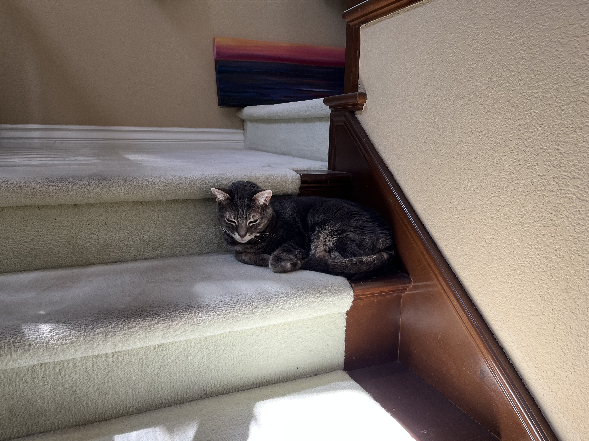
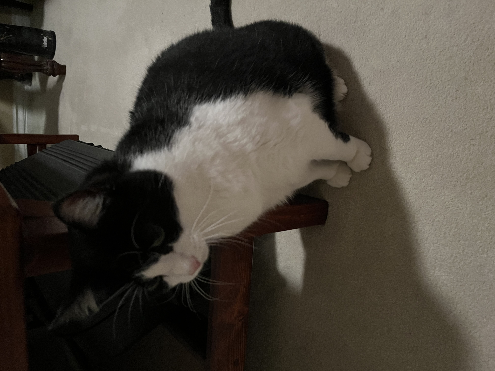

# Alex Tahan

Hi! I am a second year Computer Science student at UC San Diego, in Warren College. 

In college, I've taken courses in:
```
Data Structures, Discrete Math, Linear Algebra, Algorithms, and Data Science
```
and I have programming experience in:

- Java
- Python
- JavaScript
- C
- C++
- Assembly
- and more!


I also have experience with web application development from an internship at the San Diego Supercomputer Center.

## About Me
I grew up in San Diego, CA. Located on the west coast, next to the Pacific Ocean, and bordering Mexico, it's the 8th most populous city in the US with a population of 1,386,932<sup>[1](#footnotes)</sup>!

### Education
I attended Canyon Crest Academy for high school.

### Interests

I enjoy walking and biking around San Diego. I also play piano and like ballroom dancing.

I have two cats: `Astro` and `Skyler`. They are both over 10 years old!

> 
> Astro

> 
> Skyler

**You can see another picture [here](more_cats.md)! (*highly recommended<sup>[2](#footnotes)</sup>*)**

## Footnotes

1. San Diego Wikipedia: [https://en.wikipedia.org/wiki/San_Diego](https://en.wikipedia.org/wiki/San_Diego)
2. [More cats](more_cats.md)

3. On this page I am using Markdown, with a goal to include: 

 - [x] Headings
 - [x] Styling text
 - [x] Quoting text
 - [x] Quoting code
 - [x] External Links
 - [x] Section links
 - [x] Relative links
 - [x] Ordered and Unordered Lists
 - [x] Task lists
 - [x] Pictures
 - [ ] ~~Video Game Emulator~~
